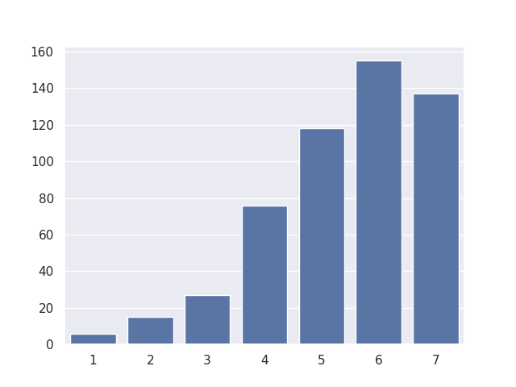
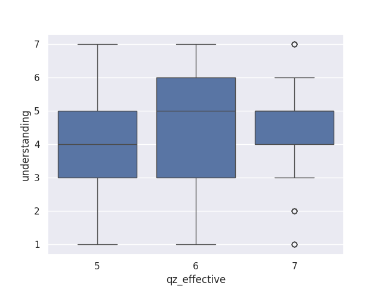
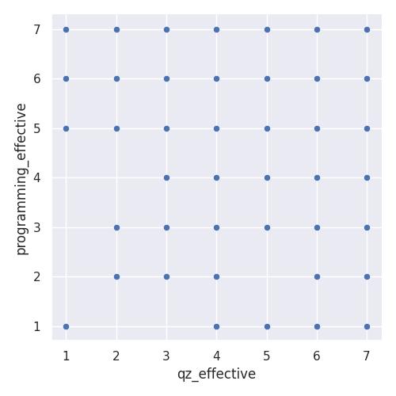

# COMP110 Data Analysis Project

## Overview
In this project, I analyzed COMP110 survey data to explore whether quizzes and other practice-based learning tools are associated with stronger student understanding.

## Idea Analyzed
I analyzed the idea that the course should incorporate more practice problems similar to quizzes and exams because they reinforce key concepts and may improve student performance.

## Visualization 1: Quiz Effectiveness vs Understanding
This scatterplot compares how effective students think quizzes are with how much they feel they understand the course material. The graph suggests only a weak positive relationship, meaning quizzes likely help, but are not the only factor influencing understanding.

## Visualization 2: Distribution of Quiz Effectiveness Ratings
This bar chart shows that most students rated quizzes between 5 and 7, indicating that quizzes are generally viewed as helpful.

## Visualization 3: High Quiz Effectiveness Filtered Data
This boxplot focuses on students who rated quiz effectiveness highly. It shows that understanding is still spread out, which suggests quizzes help but do not fully determine student success.

## Conclusion
The data suggests that quizzes are a useful learning tool and are associated with higher understanding, but they are not the only factor influencing student success. Students also appear to value other practice-based tools, such as programming assignments. Because of this, I would recommend adding more structured practice opportunities, but doing so in a low-stakes way to avoid increasing stress and workload too much.